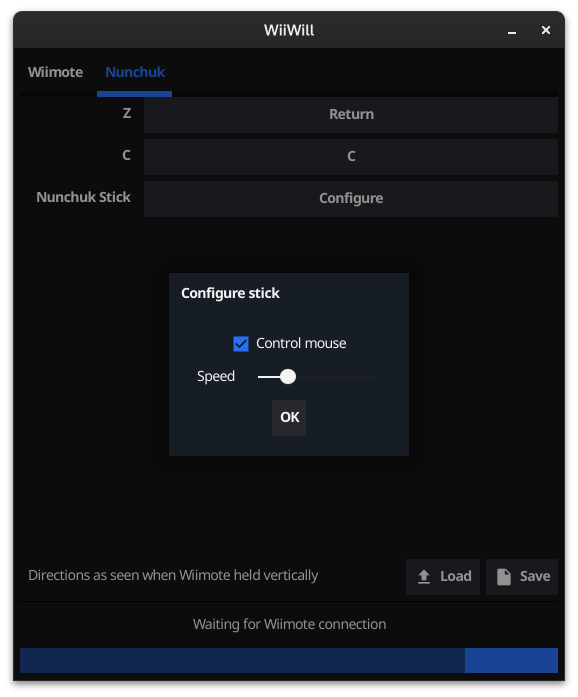

# WiiWill [Work in progress]

A simple Wii remote gamepad mapper for Linux.

## Installation and usage

1. Download the tarball from the [Releases](https://github.com/Pippadi/WiiWill/releases) section
2. Untar with `tar -xvf WiiWill.tar.xz`
3. Install `make` and run `sudo make install`
4. Launch program
5. Connect Wii remote from system's bluetooth settings

Steps 4 and 5 *must* be done in order for WiiWill to recognize the remote.
Multiple instances of the app can be launched (generally done by middle-clicking the app icon in the taskbar/dash) to handle multiple Wiimotes.

Disconnect Wiimote through system bluetooth settings.
Uninstall with `sudo make uninstall`.

## Motivations

Other similar programs seem to be ancient, unmaintained, and difficult to use.
My hope with this is to be able to distribute a single package or binary that works out-of-the-box, with no separate driver or library installation necessary.

## How it works

> #### Disclaimer
> I'm learning about how Linux handles input devices on the fly.
> There may well be better ways to achieve what I'm doing here; I'm just going by what worked for me.
> That said, suggestions and contributions are welcome.

1. Monitors `udev` for `uevent`s in which files under `/dev/input` (specified by `DEVNAME`) are created
2. Finds `DEVPATH` for `uevent` where `NAME` is specified as `"Nintendo Wii Remote"`
3. Combs through contents of `/sys/$DEVPATH` for a folder called `eventX`
4. Reads events from `/dev/input/eventX`
5. Generates mapped event through `uinput`

## Acknowledgements

- [nervo/wiican](https://github.com/nervo/wiican) for the inspiration
- [Oblomov/wiimote-pad](https://github.com/Oblomov/wiimote-pad) and [xwiimote](https://github.com/xwiimote/xwiimote) as references
